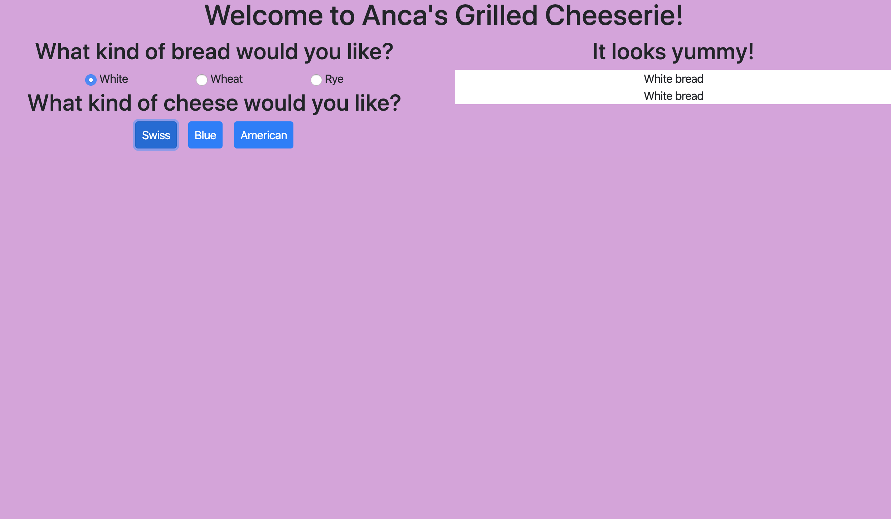

# Grilled Cheese

## Description
This project is an introduction to the ES6 Modules structure. It is a grilled cheese sandwich building function. 
Features include:
1. Ability to select one bread type from multiple bread types. 
1. Ability to select one or more cheeses from multiple cheese types.
1. Ability to visually display the sandwich being made. 

## Screenshot

## How to Run
1. Clone down this repo.
1. Make sure you have http-server installed via npm. If not get it [here](https://www.npmjs.com/package/http-server).
1. On your command line run hs -p 9999.
1. In your browser, go to http://localhost:9999.

## !!!STILL TO DO!!!
1. Get cheese to show in sandwich!!!
1. Maybe add some images to the sandwich?? instead of just color rows??
1. background image/oven? grill?